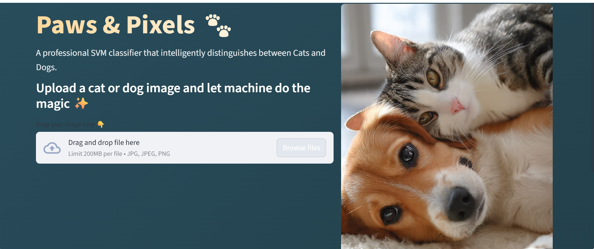
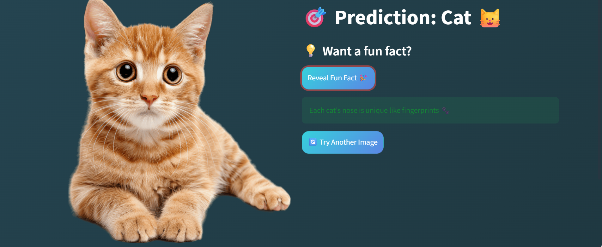

# Paws-and-Pixels-Cat-vs-Dog-Image-Classifier-Streamlit-SVM

🚀 **Live Demo:** https://paws-and-pixels-cat-vs-dog-image-classifier-app-svm-m8n2qyszri.streamlit.app/

An SVM-based Cat vs Dog image classification web application leveraging HOG feature extraction, built with Streamlit for interactive predictions and real-time image processing.


## Overview

Paws & Pixels is a machine learning web application that classifies images of cats and dogs using classical computer vision techniques and a Support Vector Machine (SVM) model.
This project demonstrates a complete end-to-end machine learning pipeline — from feature engineering to model deployment — implemented and integrated into an interactive Streamlit web interface.

---

## Problem Statement

Build a binary image classification system that can accurately distinguish between cats and dogs using traditional machine learning techniques instead of deep learning.

The objective was to:

- Understand feature extraction using HOG
- Train and evaluate an SVM classifier
- Serialize the trained model
- Deploy the model via a Streamlit web application

---

## Approach & Methodology

### 1. Data Preprocessing
- Images converted to grayscale
- Resized to fixed dimensions (128x128)
- Standardized input format

### 2. Feature Engineering
- Extracted Histogram of Oriented Gradients (HOG) features
- Captured edge and texture information
- Feature vector scaling using StandardScaler

### 3. Model Training
- Support Vector Machine (SVM) classifier
- Trained on HOG feature vectors
- Model and scaler serialized using Joblib

### 4. Deployment
- Built interactive web interface using Streamlit
- Integrated trained model for real-time inference
- Added UI enhancements using custom CSS styling

---

## Tech Stack
- Python
- NumPy
- OpenCV
- Pillow
- Scikit-learn
- Scikit-image (HOG)
- Streamlit
- Joblib

---
## Dataset

The dataset used for training is not included in this repository due to size constraints.

You can access the dataset here:
https://www.kaggle.com/datasets/bhavikjikadara/dog-and-cat-classification-dataset

## Application Preview

### Home Page


### Prediction Page



## Project Structure

```bash
Paws-and-Pixels-Cat-vs-Dog-Image-Classifier-Streamlit-SVM/
│
├── app.py                     # Streamlit web application
├── requirements.txt           # Project dependencies
│
├── models/
│   ├── svm_cat_dog_model.pkl  # Trained SVM model
│   └── feature_scaler.pkl     # Feature scaler
│
├── assets/                    # UI image assets and output screenshots
│   ├── cat_dog.jpg
│   ├── home.png              
│   └── result.png            
│
├── data/                      # Data folder
│   └── README.md              # Info about dataset
│
└── notebooks/                 # Jupyter notebooks
    └── svm_cat_dog.ipynb      # Model development notebook

```

---

## Key Highlights

- Implemented classical ML approach instead of deep learning
- Applied HOG for robust feature extraction
- Designed and implemented a complete end-to-end machine learning pipeline.
- Integrated model into deployable web interface
- Designed clean, responsive UI using Streamlit

---

## How to Run

```bash
git clone https://github.com/Muthumari10/Paws-and-Pixels-Cat-vs-Dog-Image-Classifier-Streamlit-SVM.git
cd Paws-and-Pixels-Cat-vs-Dog-Image-Classifier-Streamlit-SVM
pip install -r requirements.txt
streamlit run app.py

```

---

## What This Project Demonstrates

- Understanding of feature engineering in computer vision
- Knowledge of Support Vector Machines
- Ability to serialize and deploy ML models
- End-to-end ML system integration
- Practical application development using Streamlit

---

## License

This project is licensed under the MIT License.

## Author

Sudalaimuthumari M  
Final Year – Artificial Intelligence & Data Science  
GitHub: https://github.com/Muthumari10
